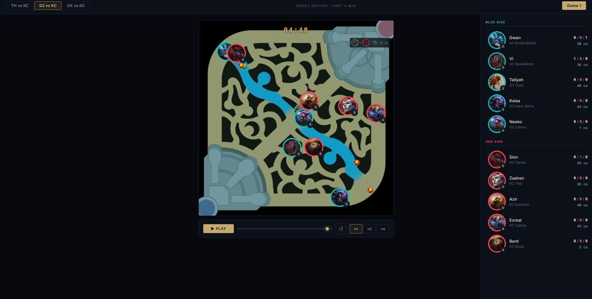

# 🗺️ LoL Scouting Replays Kit

> Replay League of Legends scrim data on an interactive minimap — built for scouting opponent tendencies in the early game.

**No cloud service. No API keys. No Node.js. Just Python + a browser.**



---

## 🔍 What You Can Scout

| | Focus | What You See |
|---|---|---|
| 🧍 | **Level 1 positioning** | Where each player starts and how they move in the first minute |
| 🟡 | **Early warding** | First and second trinket placements — position and timing |
| 🌲 | **Jungle pathing** | The jungler's route from opening clear through first gank window |
| ⚔️ | **Kill & death patterns** | Lane pressure, dives, and skirmishes in the first 5 minutes |

---

## ✨ Features

| | Feature | Details |
|---|---|---|
| 🎬 | **60 fps playback** | Smooth canvas animation with linear interpolation |
| 🏅 | **Champion badges** | Circular team-coloured icons for every player |
| 📈 | **Live levels** | Champion level updated in real time from game data |
| 💀 | **KDA tracking** | Kills / deaths / assists computed from kill events |
| 📋 | **Kill feed** | Last 8 kills with timestamps overlaid on the map |
| 🟡 | **Wards** | Yellow trinkets (90 s) and control wards with team colours |
| ⏱️ | **Death timers** | Champions disappear on death, respawn at base; sidebar countdown |
| 🌾 | **CS tracking** | Creep score per player updated in real time |
| 📂 | **Multi-series tabs** | Auto-discovers every series and game in `data/` |
| ⏯️ | **Playback controls** | Play / Pause / Scrub / Speed — ×1 / ×2 / ×4 |

---

## 📋 Requirements

| Requirement | Version |
|---|---|
| 🐍 Python | 3.9 or newer |
| pip | bundled with Python |

No Node.js, no Docker, no external services.

---

## 🚀 Quick Start

### 0️⃣ Install Python (if not already installed)

1. Go to **[python.org/downloads](https://www.python.org/downloads/)** and download Python **3.9 or newer**
2. Run the installer
3. ⚠️ **Tick "Add Python to PATH"** before clicking Install — this is the most common mistake

To verify it worked, open a terminal and run:
```bash
python --version
```
You should see `Python 3.x.x`. If you get an error, restart your terminal and try again.

---

### 1️⃣ Clone / download the project

```bash
git clone https://github.com/Boch-dev-98/lol-scouting-replay-kit.git
cd lol-scouting-replay-kit
```

Or download the ZIP from GitHub and extract it.

---

### 2️⃣ Champion icons

Champion icons are **already included** in `assets/champions/` — no action needed.

> If a champion is missing (e.g. a newly released one), place the image manually in `assets/champions/`
> Accepted formats: `Ezreal.png`, `Ezreal_0.jpg`, `ezreal.png`
> Champions without a matching image render as a coloured circle.

---

### 3️⃣ Download your game data from Grid

For each game you want to replay, export **2 files** from the [Grid](https://grid.gg) platform:

| File | Where to find it in Grid |
|---|---|
| `events_<id>_<game>_riot.jsonl` | Series page → Game → Download → **Events (Riot)** |
| `end_state_summary_riot_<id>_<game>.json` | Series page → Game → Download → **End State Summary (Riot)** |

Download both files for every game in the series.

---

### 4️⃣ Drop files into `data/`

Dump everything into `data/` with **no subfolders** — the server groups files by series and game automatically:

```
data/
  events_2901035_1_riot.jsonl
  end_state_summary_riot_2901035_1.json
  events_2901035_2_riot.jsonl
  end_state_summary_riot_2901035_2.json
  events_2901038_1_riot.jsonl
  end_state_summary_riot_2901038_1.json
```

The server reads the series ID and game number directly from the filenames.

---

### 5️⃣ Start the server

**Windows**
```bat
start.bat
```

**Mac / Linux**
```bash
chmod +x start.sh
./start.sh
```

**Or directly**
```bash
pip install -r requirements.txt
python -m uvicorn server:app --port 8000
```

---

### 6️⃣ Open in browser

```
http://localhost:8000
```

The app auto-discovers all series in `data/` and loads the first game. That's it. ✅

---

## 📁 Project Structure

```
lol-scouting-replay-kit/
├── server.py               # FastAPI backend — reads data, serves API + frontend
├── frontend/
│   └── index.html          # React 18 (CDN) single-page app
├── assets/
│   ├── map/
│   │   └── LOL_map.png     # Minimap image
│   ├── champions/          # Champion icons (already included)
│   │   └── centered/       # Optional higher-quality centered crops
│   └── wards/
│       ├── pinkward_2055.png
│       └── yellow_trinket_3340.png
├── data/                   # Drop Grid export files here
├── requirements.txt
├── start.bat               # Windows launcher
├── start.sh                # Mac/Linux launcher
└── .gitignore
```

---

## 📊 Data Format

### Files to export from Grid

For each game you need **exactly 2 files**:

| File | What it is |
|---|---|
| `events_<seriesId>_<gameNum>_riot.jsonl` | Raw event stream — positions, kills, wards |
| `end_state_summary_riot_<seriesId>_<gameNum>.json` | End-of-game summary — players, champions, teams |

### Supported folder layouts

**✅ Flat (recommended)** — drop everything directly into `data/`:

```
data/
  events_2901035_1_riot.jsonl
  end_state_summary_riot_2901035_1.json
  events_2901035_2_riot.jsonl
  end_state_summary_riot_2901035_2.json
```

**📁 Legacy nested layout** — also supported:

```
data/
└── series_<ID>/
    └── games/
        ├── 1/
        │   ├── events.jsonl
        │   └── summary.json
        └── 2/
            ├── events.jsonl
            └── summary.json
```

Both layouts can be mixed in the same `data/` folder.

### Events parsed from `events.jsonl`

| Event | Used for |
|---|---|
| `stats_update` | Player positions (x, z) and champion level, sampled every 2 s |
| `champion_kill` | Kill / death / assist events and positions |
| `ward_placed` | Ward placement — type, placer, position, time |
| `ward_killed` | Ward destruction — matched to placement by position |

> Only the **first 5 minutes** of each game are loaded (configurable via `MAX_GAME_MS` in `server.py`).

---

## 🎨 Customising Champion Images

The server looks for portrait images in this priority order:

1. `assets/champions/centered/<ChampionName>.png` *(highest priority)*
2. `assets/champions/centered/<ChampionName>_0.jpg`
3. `assets/champions/<ChampionName>.png`
4. `assets/champions/<ChampionName>_0.jpg`
5. Case-insensitive prefix match anywhere in the above folders

You can freely mix Data Dragon icons with your own custom portraits. Champions without a match render as a coloured circle with the first 6 letters of their name.

---

## ⚙️ Configuration

All tuneable constants are at the top of `server.py`:

| Constant | Default | Description |
|---|---|---|
| `MAX_GAME_MS` | `300_000` | How many ms of each game to load (5 min) |
| `STEP_MS` | `2_000` | Position snapshot interval |
| `BLUE_HEX` | `#0AC8B9` | Blue side badge border colour |
| `RED_HEX` | `#FF4655` | Red side badge border colour |

---

## 🛠️ Troubleshooting

**❓ "No game data found"**
Make sure your files are in `data/` and their names contain `_<seriesId>_<gameNum>` (e.g. `events_2901035_1_riot.jsonl`). The series ID must be 5–12 digits and the game number 1–3 digits.

**❓ Champion shows as coloured circle (no portrait)**
Place the image manually in `assets/champions/` (e.g. `Ezreal.png`).

**❓ Port 8000 already in use**
Change the port: `python -m uvicorn server:app --port 8001` and open `http://localhost:8001`.

**❓ Startup is slow**
Each game's `events.jsonl` can be 90–120 MB. Startup reads all files; subsequent page loads are instant from the in-memory cache.

**❓ Ward icons missing**
Ensure `assets/wards/pinkward_2055.png` and `assets/wards/yellow_trinket_3340.png` exist.

---

## 🧱 Tech Stack

| Layer | Technology |
|---|---|
| 🐍 Backend | Python 3, FastAPI, Uvicorn, Pillow |
| ⚛️ Frontend | React 18 (CDN), Babel Standalone (in-browser JSX), HTML Canvas |
| 🔧 Build system | None — no Node.js, no bundler |

---

## 📄 License

MIT — free to use, modify and distribute.

Champion icons and map assets are property of Riot Games and used under their [Legal Jibber Jabber](https://www.riotgames.com/en/legal).
